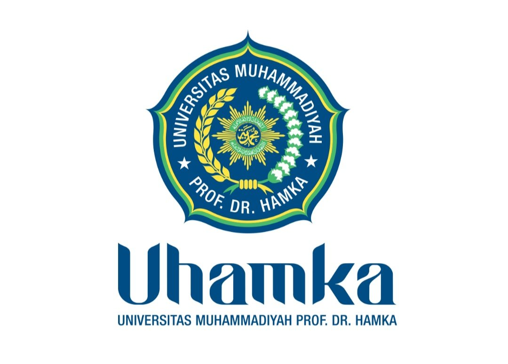

# 🎓 UHAMKA Digital Campus Assistant

> Enterprise-grade Telegram Bot untuk mahasiswa Universitas Muhammadiyah Prof. DR. HAMKA



## ✨ Fitur Utama

| Modul | Fitur |
|-------|-------|
| 🏫 **UHAMKA Info** | Fakultas, Prodi, Dosen, Beasiswa, Pengumuman, FAQ |
| 🎓 **Akademik** | Tugas, Jadwal Kuliah, Catatan, Study Planner |
| 📊 **Transkrip** | Input Nilai, IPS/IPK, Prediksi, Target |
| 📖 **Repository** | Cari Skripsi, Jurnal, Sitasi Generator |
| 🤖 **AI Assistant** | Tutor Akademik, Research, Writing, Programming |
| 📖 **Al-Qur'an** | Baca, Cari Ayat, Tafsir, Bookmark, Tilawah Tracker |
| 🕌 **Islami** | Jadwal Shalat, Dzikir, Doa Harian |
| 📈 **Habit Tracker** | Gamifikasi ibadah + kebiasaan, XP System |
| 💼 **Karir** | CV Builder, Interview Prep, Career Roadmap |
| 🌍 **Bahasa** | English, Arab, German — Vocabulary, Grammar, Quiz |
| 📄 **File Analysis** | PDF/DOCX/PPTX → Summary, Quiz, Mindmap, Flashcard |

## 🏗️ Arsitektur

```
uhamka-bot/
├── src/
│   ├── bot/
│   │   ├── commands/        # Telegram commands
│   │   ├── handlers/        # Event handlers (file, callback)
│   │   └── middlewares/     # Auth, rate limit, logging
│   ├── modules/             # Feature modules
│   │   ├── academic/
│   │   ├── transcript/
│   │   ├── research/
│   │   ├── knowledge/
│   │   ├── quran/
│   │   ├── islamic/
│   │   ├── career/
│   │   ├── language/
│   │   ├── habit/
│   │   └── dashboard/
│   ├── services/
│   │   └── providers/
│   │       └── ai-router.ts # AI Provider Failover System
│   ├── database/
│   │   └── prisma/
│   │       └── schema.prisma
│   ├── ai/                  # AI Agents & Memory
│   ├── scheduler/           # Cron jobs
│   ├── admin/               # Admin panel
│   ├── assets/
│   │   └── logo.png         # UHAMKA logo (used in /start)
│   ├── config/              # Config & validation (Zod)
│   └── utils/               # Logger, helpers
├── tests/
│   ├── unit/
│   └── integration/
├── docker/
├── docs/
├── Dockerfile
├── docker-compose.yml
├── ecosystem.config.js      # PM2
└── .env.example
```

## 🚀 Quick Start

### Prasyarat
- Node.js 20+ (direkomendasikan 20 LTS)
- PostgreSQL 14+
- Redis 7+

### 1. Clone & Install

```bash
git clone https://github.com/rafz7/University-Assistant-Bot-HAMKA-Version-1.0.7-
cd University-Assistant-Bot-HAMKA-Version-1.0.7-
npm install
```

### 2. Konfigurasi

```bash
cp .env.example .env
# Edit .env sesuai kebutuhan
nano .env
```

### 3. Setup Database

```bash
# Generate Prisma client
npx prisma generate

# Run migrations
npx prisma migrate deploy
```

### 4. Build & Start

```bash
npm run build
npm start
```

---

## 🐳 Deployment Docker

```bash
# Copy dan edit .env
cp .env.example .env
nano .env

# Build & start semua services
docker-compose up -d --build

# Lihat logs
docker-compose logs -f bot

# Stop
docker-compose down
```

---

## 🖥️ Deployment PM2

```bash
# Install PM2 globally
npm install -g pm2

# Build
npm run build

# Jalankan dengan PM2
pm2 start ecosystem.config.js --env production

# Save PM2 config
pm2 save
pm2 startup
```

---

## 🦅 Deployment Pterodactyl Panel

### Setup Node.js Egg

1. Buka Pterodactyl Panel
2. Admin → Nests → Import Egg
3. Pilih Node.js egg
4. Buat server baru dengan settings:
   - **Startup Command:** `npm install && npm run build && npm start`
   - **Docker Image:** `ghcr.io/pterodactyl/yolks:nodejs_20`
5. Upload semua file proyek ke server

### Environment Variables di Panel
Isi semua variabel dari `.env.example` di bagian Startup tab.

---

## 🤖 AI Provider System

Bot menggunakan sistem AI failover otomatis:

```
Request → Gemini Key 1 → Fail → Gemini Key 2 → Fail → Gemini Key 3
       → Fail → Groq Key 1 → Fail → Groq Key 2 → Fail → Groq Key 3
```

- **Timeout:** 30 detik per provider
- **Auto-cooldown:** Provider gagal 3x → cooldown 5 menit
- **Health Monitoring:** Real-time provider stats

Dapatkan API Key gratis:
- **Gemini:** https://aistudio.google.com/app/apikey
- **Groq:** https://console.groq.com

---

## 📊 Admin Panel

Khusus owner (`@ravzxz`), akses dengan:
```
/admin
```

Fitur:
- 📢 Broadcast ke semua pengguna
- 👥 Statistik pengguna
- 🤖 Statistik AI provider
- 📊 System monitoring
- 🔒 Block/unblock user

---

## 🔒 Keamanan

- ✅ Rate limiting (30 req/menit per user)
- ✅ Input validation dengan Zod
- ✅ JWT untuk admin
- ✅ Role-based access (STUDENT, ADMIN, OWNER)
- ✅ Audit logs
- ✅ Spam protection

---

## 📞 Support

- **Owner:** @ravzxz
- **Website:** uhamka.ac.id

---

*Built with ❤️ for UHAMKA students*
